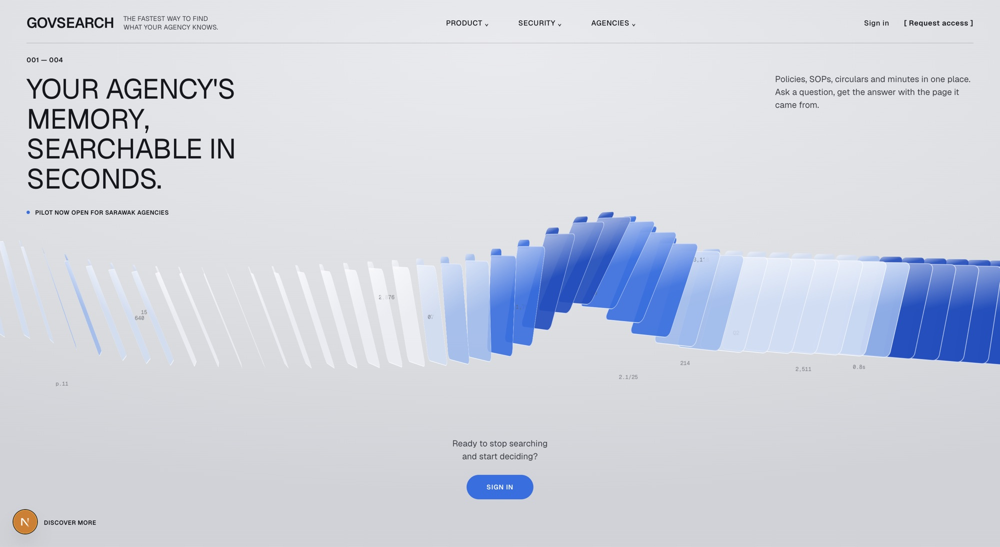
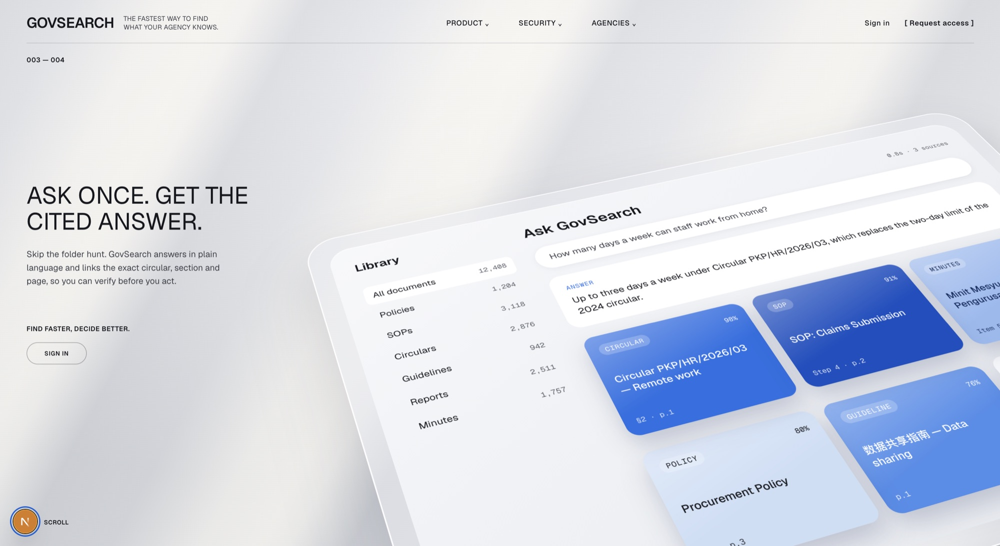
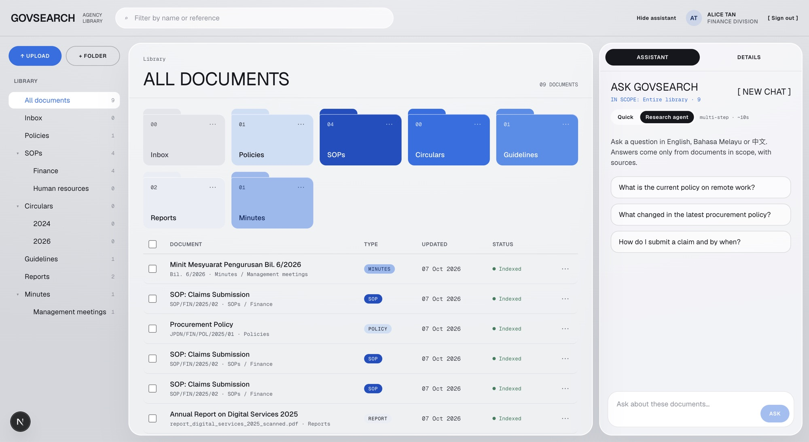
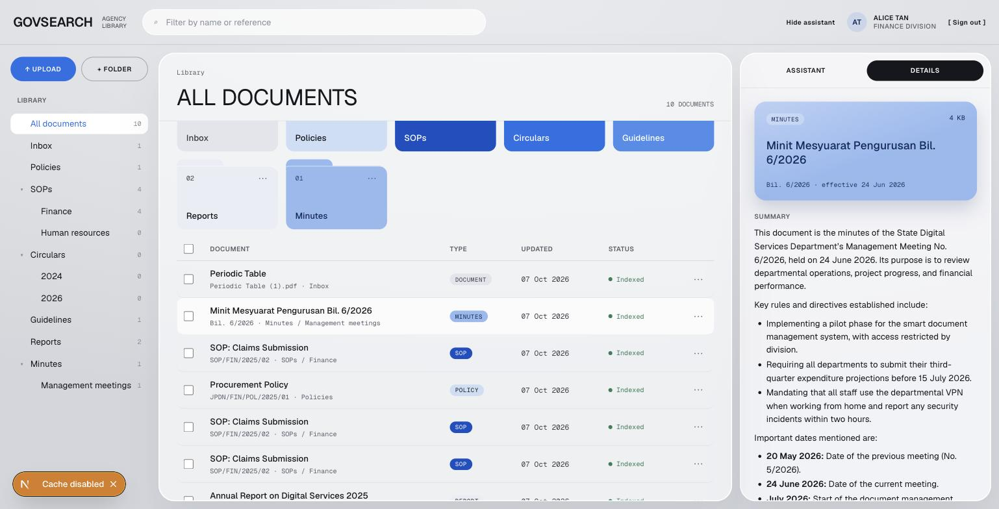
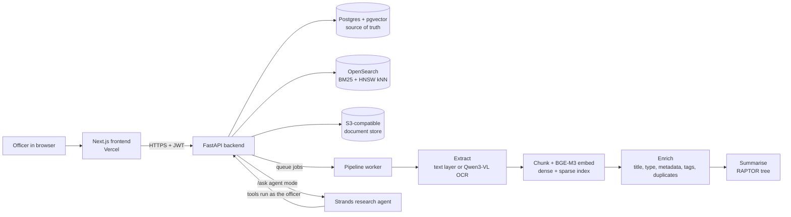

<div align="center">

# GovSearch

### Your agency's memory, searchable in seconds.

**Ask a question in English, Bahasa Melayu or 中文. Get the answer, with the exact circular, section and page it came from.**

Built for the AWS hackathon · Pilot concept for Sarawak government agencies

**Team:** Marcus Yeo Kuok Huang · Eric Carlson Anak Herryson

</div>



---

## The problem

Government agencies keep thousands of policies, SOPs, circulars, guidelines, reports and meeting minutes. They are spread across shared drives and scanners, written in three languages, and many are scans that ordinary search cannot read. When a circular replaces an older one, nothing tells you. Officers lose hours hunting for the right page, and decisions get made on outdated rules.

## What GovSearch does

1. **Drop in any document.** PDF, Word, Excel, or a photo of a scanned page. GovSearch reads it, including scanned pages, Malay and Chinese text.
2. **It organises itself.** Every document gets a clear title, a type (policy, SOP, circular, guideline, report, minutes), its reference number and effective date, a plain-language summary, and is filed into the right folder automatically.
3. **Search like you talk.** Type a phrase, a typo, a paraphrase or a question in another language. GovSearch still finds it.
4. **Ask and get a cited answer.** The assistant answers only from your documents, shows its sources, and says when a rule has been replaced by a newer circular.
5. **Everyone sees only what they are cleared to see.** A Finance officer never gets search hits, suggestions or answers from HR-only documents.



---

## Core design

### 1. Accurate extraction with OCR and a vision language model

Each page of a document is routed on its own. Pages that already contain text are read directly (PyMuPDF, python-docx, openpyxl). Pages that are only images, such as scans or photos, are sent to a **vision language model (Qwen3-VL)** that transcribes them faithfully, keeping headings and table rows and never translating. A 4-page report with 2 scanned pages gets OCR on exactly those 2 pages, which keeps it fast and cheap.

Everything comes out in one common block format (heading, paragraph, table), so titles, chunking, summaries and search all work the same for every file type.

### 2. Multilingual sparse + dense indexing

Every document is split into chunks that follow its own headings, so editing one section only changes that section's chunks. Each chunk is then indexed **two ways at once**:

| Index | What it captures | How it is scored |
|---|---|---|
| **Dense** (meaning) | A 1024-dimension **BGE-M3** embedding, one multilingual model for English, Malay and Chinese | **Cosine similarity**, k-nearest-neighbour search on an HNSW graph |
| **Sparse** (exact words) | An inverted index of the words themselves, plus a Chinese-aware (CJK) analyser | **BM25** with typo tolerance (fuzzy matching) |

### 3. Hybrid semantic + lexical search

A question runs against both indexes in parallel. The two ranked lists are merged with **Reciprocal Rank Fusion (RRF)**, so a result wins if either signal is strong:

- **Semantic** search finds "work from home allowance" when the document says "connectivity allowance for remote officers", and finds a Chinese guideline from an English question.
- **Lexical** search nails exact reference numbers like `PKP/HR/2026/03`, names and figures that embeddings blur.

Results are then grouped per document, superseded circulars are ranked lower and labelled, and every query carries a server-side department filter that the browser cannot change. A separate typo-tolerant title index powers instant suggestions as you type (`quartely bud` → *Quarterly Budget Q3 2026*).

### 4. Answers you can verify

- **Quick mode** does one hybrid search and streams a cited answer in about 2 to 3 seconds.
- **Research agent mode** (built on **Strands Agents**, AWS's open-source agent framework) plans, runs several focused searches, reads document metadata, and compares versions to answer questions like *"What changed in the latest procurement policy?"* with a before/after table. Every tool the agent uses runs with the officer's own permissions, so it can never cite a document the officer could not open.



### 5. Pay only for what changed

When a new version is uploaded, a **Merkle tree** over the chunk IDs pinpoints exactly which sections changed. Only those chunks are re-embedded and only the affected parts of the summary tree are refreshed. In our demo, editing one section of a 10-section policy reused 9 of 10 chunks.

### 6. Summaries at every level

A **RAPTOR**-style tree clusters related chunks and summarises them level by level up to one root summary. That root becomes the document summary in the Details panel and powers thematic questions such as *"the report about digital priorities"*.



---

## Architecture



| Layer | Technology |
|---|---|
| Frontend | Next.js 16, React 19, TypeScript |
| API | FastAPI, Server-Sent Events for streamed answers |
| Pipeline | Python worker with a Postgres job queue (retries, backoff) |
| Search | OpenSearch 2.19: BM25 sparse index + HNSW dense vectors, RRF fusion |
| Storage | Postgres 17 + pgvector, S3-compatible object store (content-addressed by SHA-256) |
| Embeddings | BGE-M3 (multilingual, 1024-d) |
| OCR | Qwen3-VL vision language model, per-page routing |
| Enrichment and summaries | Gemini Flash Lite |
| Answers and agent | Claude Haiku 4.5 via Strands Agents |
| Duplicate detection | SHA-256 exact match, MinHash LSH near match, cosine semantic check |

All models are reached through OpenRouter today and are configured with environment variables, so each one can be swapped for its Amazon Bedrock, SageMaker or Textract equivalent without code changes in the core.

## Results on the demo corpus

The demo uses a synthetic corpus for a fictional agency (Jabatan Perkhidmatan Digital Negeri). No real government documents are used.

| Check | Result |
|---|---|
| Right document in the top 5 search results | **26 of 26 queries (100%)** across exact phrases, paraphrases, typos, Malay, Chinese and thematic questions (target: 90%) |
| Upload to searchable and summarised | About 6 to 12 seconds per document with real models |
| Department isolation | Zero cross-department results in search, suggestions, answers and citations, verified at API level |
| Version update | 9 of 10 chunks reused after a one-section edit |
| Superseded circulars | The 2024 circular is automatically marked as replaced by the 2026 one, and answers cite the newer rule |
| Automated tests | 167 unit tests, 18 end-to-end acceptance and integration tests |

---

## Repository layout

```
.
├── backend/     FastAPI API, pipeline worker, search, agent, tests   → backend/README.md
├── frontend/    Next.js web app (landing page + library)             → frontend/README.md
├── docs/        Screenshots used in this README
└── hackathonprd.md   Product requirements and build plan
```

## Run it locally

You need Docker (OrbStack or Colima on macOS), [uv](https://docs.astral.sh/uv/), Node.js 20.9 or newer, and an [OpenRouter](https://openrouter.ai/keys) API key. Without a key the backend runs in an offline fake-AI mode.

```bash
# Backend (one terminal per long-running command)
cd backend
cp .env.example .env            # add your OPENROUTER_API_KEY
make up && make migrate
make api                        # http://localhost:8000
make worker
make corpus && make seed        # synthetic demo documents

# Frontend
cd ../frontend
cp .env.example .env.local
npm install && npm run dev      # http://localhost:3000
```

Sign in on the landing page with a demo officer email, for example `alice@jpdn.sarawak.gov.my` (Finance), `ben@…` (Human Resources), `chloe@…` (both, read-only) or `admin@…`.

## Deploy the frontend to Vercel

[](https://vercel.com/new/clone?repository-url=https%3A%2F%2Fgithub.com%2Fericcarlson994-max%2FAWS-hacakthon&root-directory=frontend&project-name=govsearch&env=NEXT_PUBLIC_API_BASE_URL&envDescription=Public%20HTTPS%20URL%20of%20the%20GovSearch%20FastAPI%20backend)

1. Import this repository in Vercel and set **Root Directory** to `frontend` (the button above does this for you).
2. Set `NEXT_PUBLIC_API_BASE_URL` to the backend's public **HTTPS** URL.
3. On the backend, allow the Vercel domain: `CORS_ORIGINS=https://your-app.vercel.app`, or `CORS_ORIGIN_REGEX=https://.*\.vercel\.app` to also allow preview deployments, then restart the API.

The backend runs Docker services and a background worker, so it is hosted separately (for example a single AWS EC2 instance running the same `docker compose`, or a tunnel from a laptop for a live demo). See [frontend/README.md](frontend/README.md) for details.

## Roadmap to production on AWS

| Today (pilot) | On AWS |
|---|---|
| S3-compatible store in Docker | Amazon S3 |
| Postgres + pgvector in Docker | Amazon RDS for PostgreSQL |
| OpenSearch in Docker | Amazon OpenSearch Service |
| Postgres job queue + worker | Amazon SQS + AWS Step Functions + AWS Lambda |
| OpenRouter models | Amazon Bedrock (Claude, embeddings), Amazon Textract + Bedrock vision for OCR |
| Strands agent in the API | Strands on Amazon Bedrock AgentCore |
| Demo sign-in | Amazon Cognito with agency SSO |

The core logic depends only on small interfaces (storage, search index, embedder, LLM, OCR, queue), so moving to AWS means adding adapters, not rewriting the product.

## Honest limitations

- Sign-in is a pilot stand-in: the email's username selects a demo officer and passwords are not checked yet. Do not upload real documents to a public deployment.
- Model calls currently go to OpenRouter. Production would keep data in-region with Amazon Bedrock.

---

<div align="center">

**GovSearch** · Find faster, decide better.

Marcus Yeo Kuok Huang · Eric Carlson Anak Herryson

</div>
